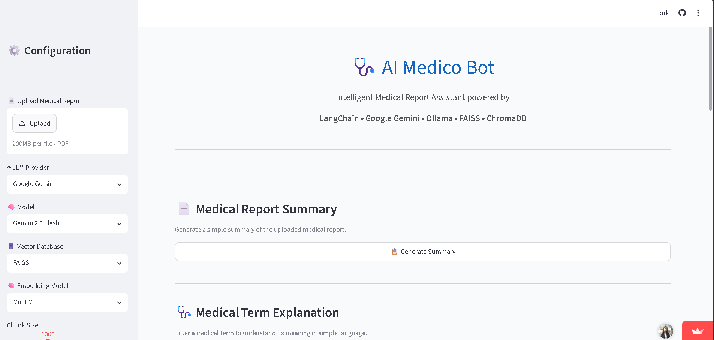
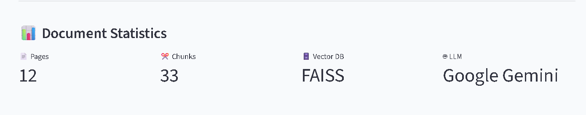
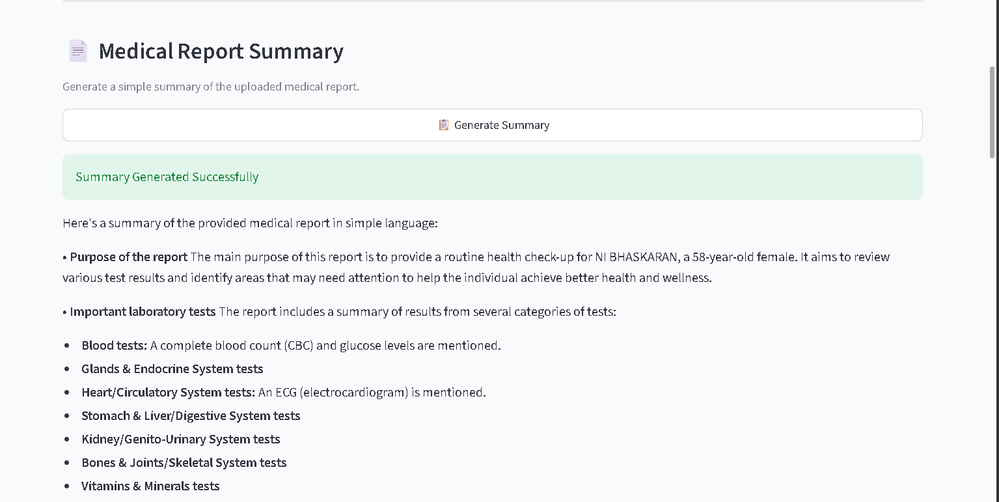
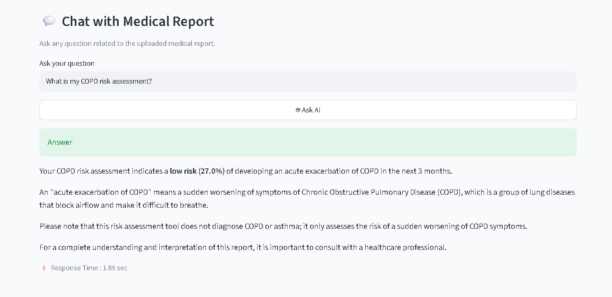
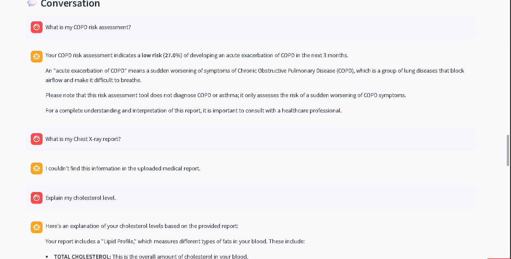
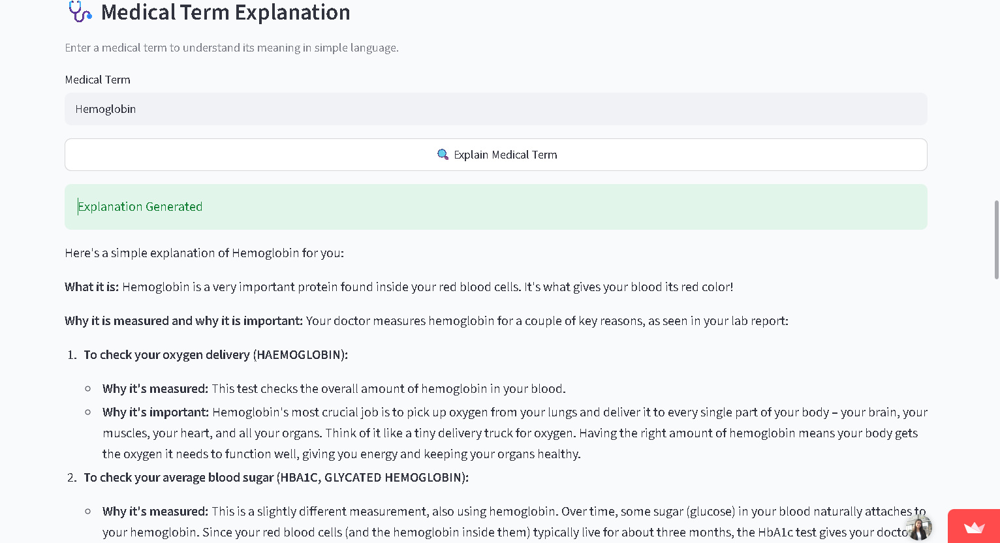
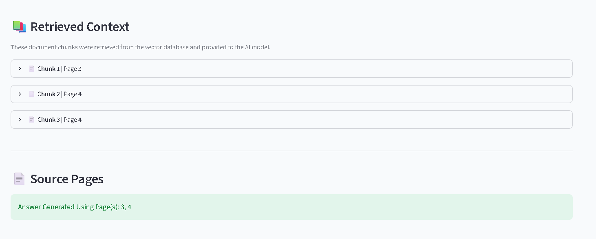

# AI Medico Bot

AI Medico Bot is a Retrieval-Augmented Generation (RAG) application designed to assist users in understanding medical reports. It enables users to upload PDF-based medical reports, generate concise summaries, explain medical terminology, and ask context-aware questions using information retrieved from the uploaded document.

## Live Demo

**Live Demo:** <https://aimedicobot.streamlit.app/>

> **Note:** The application may take a few seconds to load if it has been inactive.

---

## Features

- Upload and analyze medical report PDFs
- Generate concise report summaries
- Ask questions about uploaded medical reports
- Explain medical terms in simple language
- View retrieved context used to generate responses
- Display source pages for improved transparency
- Support for Google Gemini and Ollama
- Multiple embedding model options
- Choose between FAISS and ChromaDB
- Adjustable chunk size, chunk overlap, and Top-K retrieval
- Conversation history
- Interactive Streamlit interface

---

## Tech Stack

| Category | Technology |
|----------|------------|
| Language | Python |
| Frontend | Streamlit |
| Framework | LangChain |
| Generative AI | Google Gemini, Ollama |
| Embeddings | HuggingFace Sentence Transformers |
| Vector Database | FAISS / ChromaDB |
| PDF Loader | PyPDFLoader |
| Text Splitter | RecursiveCharacterTextSplitter |

---

## Architecture

```text
          Medical Report (PDF)
                    │
                    ▼
            Extract PDF Content
                    │
                    ▼
          Split into Text Chunks
                    │
                    ▼
     Generate Vector Embeddings
                    │
                    ▼
      Store in FAISS / ChromaDB
                    │
                    ▼
      Retrieve Relevant Context
                    │
                    ▼
         Google Gemini / Ollama
                    │
                    ▼
      ┌─────────────┼─────────────┐
      ▼             ▼             ▼
 Report Summary   Medical Q&A   Term Explanation
```

---

## Project Structure

```text
AI_Medico_Bot/
│
├── app.py
├── requirements.txt
├── .gitignore
├── .gitattributes
│
├── data/
├── database/
├── images/
│   ├── home.png
│   ├── Report-summary.png
│   ├── Chat-interface.png
│   ├── Conversation-history.png
│   ├── Medical-term-explanation.png
│   ├── Retrieved-context.png
│   └── Document-statistics.png
│
└── utils/
    ├── __init__.py
    ├── embeddings.py
    ├── llm.py
    ├── loader.py
    ├── prompts.py
    ├── rag_chain.py
    ├── splitter.py
    └── vectorstore.py
```

---

## Installation

### Clone the repository

```bash
git clone https://github.com/IshaniAggarwal/AI_Medico_Bot.git
cd AI_Medico_Bot
```

### Create a virtual environment

```bash
python -m venv venv
```

Activate the environment.

**Windows**

```bash
venv\Scripts\activate
```

**Linux / macOS**

```bash
source venv/bin/activate
```

### Install dependencies

```bash
pip install -r requirements.txt
```

### Configure Environment Variables

Create a `.env` file and add your Google Gemini API key.

```env
GOOGLE_API_KEY=YOUR_API_KEY
```

### Run the application

```bash
streamlit run app.py
```

---

## How to Use

1. Upload a medical report in PDF format.
2. Select the LLM provider, embedding model, and vector database.
3. Build the vector database.
4. Generate a report summary.
5. Explain medical terms from the report.
6. Ask questions about the uploaded report.
7. Review the retrieved context and source pages.

---

## Screenshots

### Home



### Document Statistics



### Report Summary



### Chat Interface

| Ask Questions | Conversation History |
|---------------|----------------------|
|  |  |

### Medical Term Explanation



### Retrieved Context



---

## Medical Disclaimer

This application is intended for educational and informational purposes only.

It does not diagnose diseases, prescribe medications, or replace professional medical advice. All responses are generated using the uploaded medical report and the selected language model. Users should always consult a qualified healthcare professional for diagnosis and treatment.

---

## Future Enhancements

- Support multiple medical reports
- OCR support for scanned reports
- Report comparison across visits
- Export summaries as PDF
- Streaming AI responses
- Docker containerization

---

## Author

**Ishani Aggarwal**

- **LinkedIn:** [Ishani Aggarwal](https://www.linkedin.com/in/ishani-aggarwal-643259320/)
- **GitHub:** [IshaniAggarwal](https://github.com/IshaniAggarwal)

Feedback and suggestions are always welcome.
